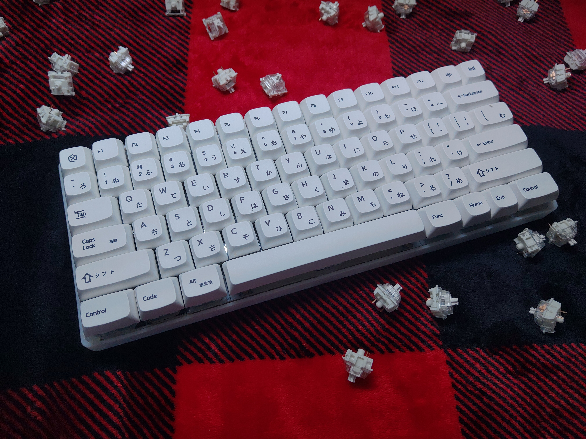
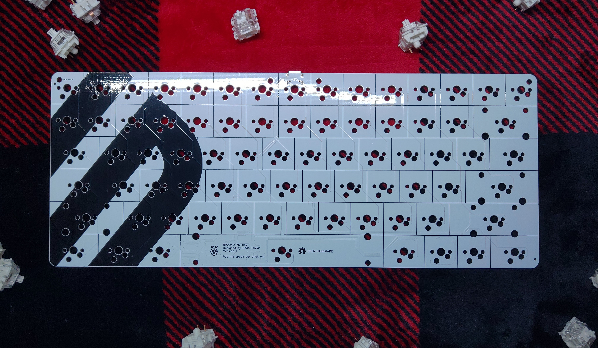
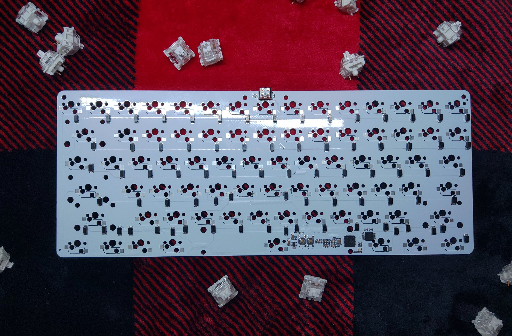
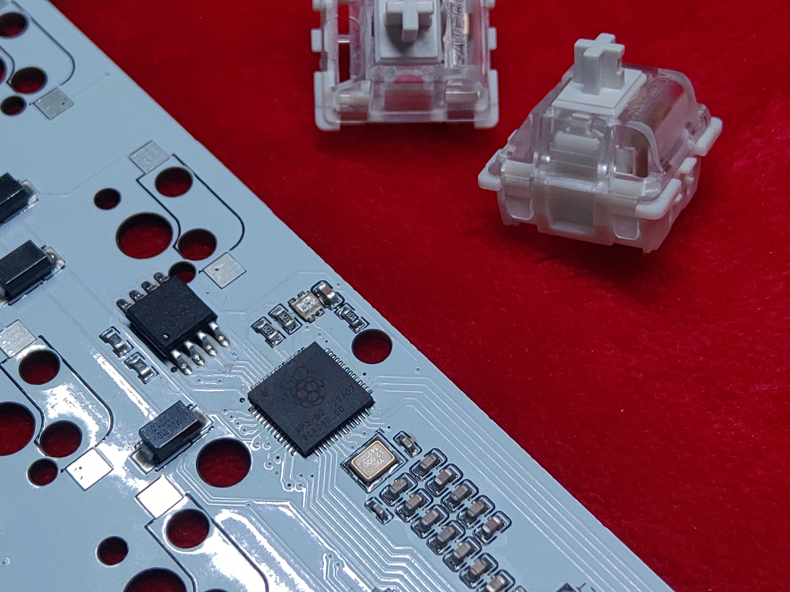

<h1 align="center">sf2040</h1>

<p align="center">
    <a href="https://certification.oshwa.org/us002610.html">
        
    </a>
    <a href="https://qmk.fm/">
        
    </a>
</p>

### About
The sf2040 is a mechanical 76-key keyboard based on the [RP2040](https://datasheets.raspberrypi.com/rp2040/rp2040-datasheet.pdf) microcontroller from Raspberry Pi.

> This project has been certified by the OSHWA as open source hardware.
>
> ```html
> [OSHW] US002610 | Certified open source hardware | oshwa.org/cert
> ```

### Features

- USB Type-C Port
- Fully open-source/open-hardware design and firmware files
- **No LED backlight**
- **No Bluetooth/wireless connectivity**

### Gallery


<div float="center">
    
    
</div>

### Assembly/Mechanical Information

**Required** parts:

- PCB ([Download Gerber](/pcb/Gerber/Gerber.zip))
- 3D-printed case ([Download .STEP](/case/Case.step))
- Keyswitch plate ([Download .STEP](/plate/Plate.step))
- _Your choice of 76 full-size MX-style keyswitches_
- MX-style Hot Swap Switch Mounts ([Amazon](https://www.amazon.com/gp/product/B0B4W9YMGM))
- Screw-in PCB Mount Stabilizers ([Amazon](https://www.amazon.com/gp/product/B0CN38CXQ3))

**Optional, but recommended** parts:

- 0.5mm Foam Switch Dampeners ([Amazon](https://www.amazon.com/gp/product/B0B942VCMV))
- Krytox 205 Grade 0 Lubricant
- Switch disassembly tools
- Case filler (I used polyester fiber)

### Firmware

This keyboard runs standard [QMK firmware](https://docs.qmk.fm/#/), configuration for which is included in this repository.

> The firmware can be downloaded pre-configured for this keyboard [here](/firmware/builds/sf2040.uf2).

The contents of the [firmware](/firmware) folder should be copied into QMK's working keyboard directory (usually `qmk_firmware/keyboards`) before building.

Build with support for VIA enabled:

```sh
qmk compile -kb sf2040 -km via
```

The RP2040's bootloader can be accessed by holding the **ESC** key while plugging in the keyboard. Then, simply drag-and-drop the output `.uf2` firmware into the bootloader folder.

This keyboard has been merged into the [QMK repository](https://github.com/qmk/qmk_firmware/tree/master/keyboards) and [VIA's keyboard repository](https://github.com/the-via/keyboards), meaning that it is fully compatible with the VIA online keyboard configuration software ([usevia.app](https://usevia.app))

> For more information about setting up and working with [QMK](https://docs.qmk.fm/#/) keyboard firmware, read the QMK documentation (https://docs.qmk.fm).

### License

The sf2040 keyboard design and firmware is released under the GPL3 license. Contributions and pull requests to this repository are always welcome!
